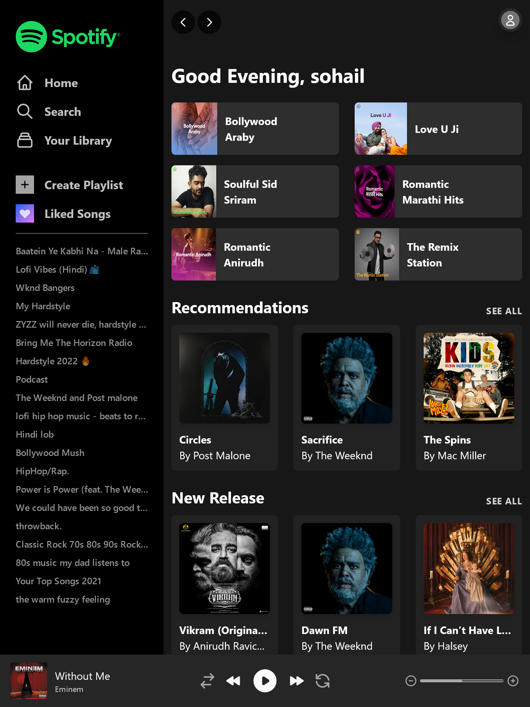

# Spotify clone V2

This is a my second attempt to create spotify clone using [Next.js](https://nextjs.org/) and [TailwindCSS](https://tailwindcss.com/). In first attempt with [Spotify clone](https://github.com/thesohailjafri/spotifyclone) I build it using [React.js](https://reactjs.org/) and Custom CSS.

- [Spotify Clone 1st attempt](https://github.com/thesohailjafri/spotifyclone)

## Table of contents

- [Overview](#overview)
  - [Screenshot](#screenshot)
  - [Links](#links)
- [My process](#my-process)
  - [Built with](#built-with)
  - [What I learned](#what-i-learned)
  - [Useful resources](#useful-resources)
- [Author](#author)

## Overview

### Screenshot

<table border=0>
 <tr>
    <td><b style="font-size:20px">Desktop</b></td>
 </tr>
 <tr>
		<td>
		1) Desktop-Login page
		
		</td>
		<td>
		2) Desktop-Player
		
		</td>
 </tr>
 <tr>
    <td>
		3) Desktop-Playlist Page
		
				</td>
    <td>
    	4) Desktop-Album Page
    	
				</td>
</tr>
<tr>
    	5) Desktop-Home Page 
    	
</tr>
</table>
<table border="0">

  <tr >
    <td width='70%'><b style="font-size:20px">Tablet</b></td>
    <td width='30%'><b style="font-size:20px">Mobile</b></td>
 </tr>
 <tr>
    <td>
		1) Tablet-Login Page
	
	2) Tablet-Home Page

3) Tablet-Playlist Page

4) Tablet-Player

</td>
    <td>
		1) Mobile-Login Page

2) Mobile-Home Page

3) Mobile-Playlist Page

4) Mobile-Player

5) Mobile-Album Page

    	</td>

 </tr>
</table>

### Links

- [Project URL](https://github.com/thesohailjafri/spotify-clone-v2)

## My process

1. First i did Sidebar and Header components.
2. Worked on the Login page.
3. Worked on the Home page.
4. Worked on the Playlist page.
5. Worked on the Player component.
6. Worked on the Album page.
7. Worked on the Number of cards visible based on width of page (using lodash.debounce and tailiwind breakpoints).

### Built with

- Next.js
- Tailwind CSS v3
- Flexbox
- CSS Grid
- Mobile-first workflow

### What I learned

I learned how to SSR(server side rendering) and CSR(client side rendering) using Next.js and spotifyApi.

### Useful resources

- [tailwindcss.com](https://tailwindcss.com/) - Tailwind CSS documentation

## Author

- Website - [TheSohailJafri](https://thesohailjafri.netlify.app/)
- Frontend Mentor - [@thesohailjafri](https://www.frontendmentor.io/profile/thesohailjafri)
- HackerRank - [@thesohailjafri](https://www.hackerrank.com/thesohailjafri)
- Twitter - [@Sinja97881141](https://twitter.com/Sinja97881141)
